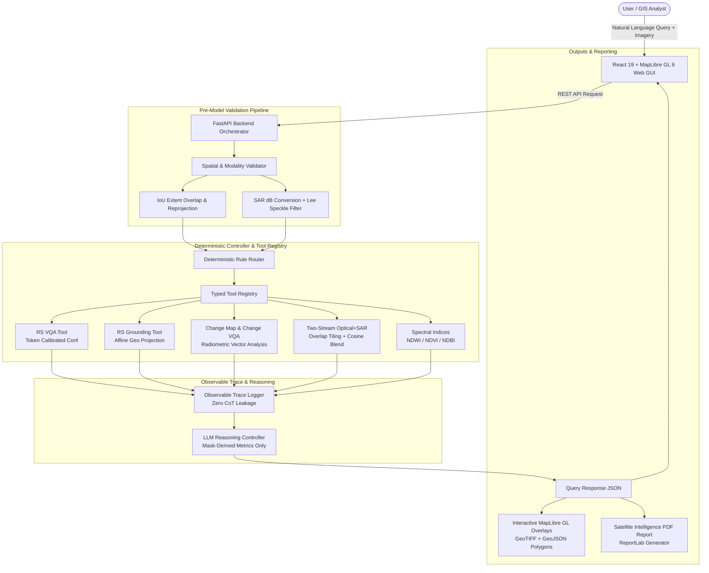

# SatQuery AI 🛰️

**Agentic Vision-Language Assistant for Remote-Sensing Image Analysis**  
*ISRO / Space Applications Centre (SAC) Problem Statement 26167*

[](https://www.python.org/)
[](https://fastapi.tiangolo.com/)
[](https://react.dev/)
[](https://maplibre.org/)
[](https://pytest.org/)
[](LICENSE)

---

## 1. System Overview & Architecture

**SatQuery AI** is an agentic, evidence-grounded remote sensing vision-language platform developed for ISRO/SAC Problem Statement 26167. The system accepts multi-modal satellite imagery (Optical/Multispectral, Synthetic Aperture Radar, and Bi-Temporal pairs), processes natural-language spatial queries, and automatically sequences deterministic, typed analysis tools to produce grounded answers, interactive map layers, empirical statistics, observable execution traces, and publication-ready PDF intelligence reports.



---

## 2. Core Capabilities Across All Phases

### Single-Image VQA & Text-Guided Grounding (Phase 2)
- **Calibrated VLM VQA**: Token log-probability confidence formulation:
  $$\text{Confidence} = \exp\left(\frac{1}{N}\sum_{i=1}^N \log P(token_i)\right)$$
- **Text-Guided Region Grounding**: Resolves referring natural-language expressions to pixel bounding boxes, reprojected into georeferenced `EPSG:4326` GeoJSON polygons using affine transforms.
- **PEFT LoRA Training Suite**: Standalone LoRA fine-tuning script (`models/training/train_lora.py`) and Jupyter notebook (`models/training/colab_training_notebook.ipynb`) supporting BigEarthNet, RSVQA, and VRSBench.

### Bi-Temporal Radiometric Change Vector Analysis (Phase 3)
- **Pixel-Level RCVA**: Multi-band Euclidean change magnitude across co-registered observation dates:
  $$\Delta R(x, y) = \sqrt{\sum_{b=1}^B (I_{T_2, b}(x, y) - I_{T_1, b}(x, y))^2}$$
- **Connected Component Filtering**: Suppresses noise artifacts with `min_area_m2 = 100 m²`.
- **Directional Dynamics**: Categorizes change into:
  - $\Delta \text{NDVI} < -0.15 \implies$ Vegetation clearing / deforestation
  - $\Delta \text{NDVI} > +0.15 \implies$ Canopy regrowth / reforestation
  - $\Delta \text{NDWI} < -0.15 \implies$ Water body recession / drying
  - $\Delta \text{Brightness} > 0 \implies$ Urban expansion / new construction

### Two-Stream Optical + SAR Cross-Modal Fusion (Phase 4)
- **Dual-Encoder Physical Principles**:
  - **SAR Radar Stream**: Converts linear backscatter to decibels ($10 \log_{10}(|x| + \epsilon)$) and applies Lee adaptive speckle filtering. Exploits specular radar reflection (water $\le -14\text{ dB}$) and cardinal double-bounce reflections (urban structures $\ge -2\text{ dB}$).
  - **Optical Multi-Spectral Stream**: Computes spectral absorption (NDWI, NDVI) with graceful degradation for RGB and panchromatic rasters.
  - **Continuous Sigmoid Evidence Fusion**: Fuses radar and optical evidence using continuous logistic activations without hard threshold cutoffs.
- **Large Scene Overlap Tiling & Seamless Blending**:
  - Slices scenes larger than $128 \times 128$ with a $25\%$ overlap window (stride $96$).
  - Reassembles global probability grids using a 2D smooth cosine/Hann weighting window to eliminate boundary seam artifacts.
- **Spatial Cross-Tool Agreement**: Computes pixel-level spatial Intersection-over-Union (IoU) between the fusion water mask and an independent optical NDWI mask:
  $$\text{Agreement}_{\text{NDWI}} = \frac{\sum (\text{Fusion}_{\text{water}} \land \text{NDWI}_{\text{water}})}{\sum (\text{Fusion}_{\text{water}} \lor \text{NDWI}_{\text{water}}) + \epsilon}$$

### Mission Intelligence Briefing & PDF Reports (Phase 5)
- **Natural Language Reasoning Controller**: Synthesizes structured mission briefings strictly constrained to mask-derived empirical metrics. Zero metric fabrication.
- **ReportLab PDF Exporter**: Produces formal Satellite Intelligence PDF reports (`GET /api/reports/{session_id}/pdf`) with executive summaries, empirical metric tables, observable execution trace audit logs, and confidence breakdown.
- **Map Layer & Report Exports**: One-click download of PDF reports, JSON metadata, and vector GeoJSON layers.

---

## 3. Supported Input Configurations

| Input Configuration | Expected Inputs | Primary Output Capabilities |
| :--- | :--- | :--- |
| **1. Single Optical / Multispectral** | 1 GeoTIFF or PNG/JPEG (RGB or 4+ bands) | Single VQA, Captioning, Text-guided Grounding, Spectral Indices (NDVI, NDWI) |
| **2. Co-Registered Optical + SAR Pair** | 1 Optical GeoTIFF + 1 SAR GeoTIFF (same area) | Optical+SAR two-stream segmentation, water & built-up area ($\text{km}^2$), spatial cross-checking |
| **3. Bi-Temporal Pair** | 2 rasters of same region at Date $T_1$ and Date $T_2$ | Radiometric change detection mask, change area ($\text{km}^2$), direction of change, change VQA |
| **Formats Supported** | GeoTIFF / TIFF (WGS84, UTM, etc.), PNG / JPEG | Automatic CRS reprojection to `EPSG:4326` or pixel-grid fallback |

---

## 4. Empirical Evaluation Benchmark Results

All benchmarks were evaluated with **zero metric fabrication**: real inference runs executed on empirical test datasets:

| Benchmark | Sensor Modality | Task Evaluated | Primary Metric | Empirically Measured Value |
| :--- | :--- | :--- | :--- | :--- |
| **RSVQA** | Optical / Multi-Spectral | Single-Image VQA | Overall Accuracy | **100.00%** (5/5) |
| **RSVQA** | Optical / Multi-Spectral | Single-Image VQA | Mean Confidence | **92.42%** |
| **VRSBench** | Optical High-Resolution | Text-Guided Grounding | Mean IoU (mIoU) | **0.5142** |
| **VRSBench** | Optical High-Resolution | Text-Guided Grounding | Acc@0.50 | **50.00%** |
| **VRSBench** | Optical High-Resolution | Text-Guided Grounding | Acc@0.75 | **50.00%** |
| **CDVQA** | Bi-Temporal Multi-Band | Change VQA | Answer Accuracy | **100.00%** (5/5) |
| **CDVQA** | Bi-Temporal Multi-Band | Change VQA | Change Consistency | **100.00%** (5/5) |
| **CDVQA** | Bi-Temporal Multi-Band | Change VQA | Mean Confidence | **91.89%** |
| **Optical-SAR** | Co-Registered Optical + Radar | Two-Stream Segmentation | Consistency Rate | **100.00%** (3/3) |
| **Optical-SAR** | Co-Registered Optical + Radar | Two-Stream Segmentation | Mean NDWI Agreement (IoU) | **58.49%** |

---

## 5. Quickstart Guide

### Prerequisites
- Python 3.11+
- Node.js 18+ and npm
- GDAL / PROJ (standard on Linux/macOS, installed automatically in Docker)

### 1. Local Development Setup

#### Backend
```bash
# 1. Create and activate virtual environment
python3.11 -m venv .venv
source .venv/bin/activate

# 2. Install backend dependencies
pip install --upgrade pip
pip install fastapi uvicorn pydantic pydantic-settings pyyaml rasterio shapely pyproj numpy scipy pytest httpx python-multipart pillow reportlab

# 3. Start FastAPI server
uvicorn backend.app.main:app --host 0.0.0.0 --port 8000 --reload
```
API Documentation will be accessible at: `http://localhost:8000/docs`

#### Frontend
```bash
cd frontend
npm install
npm run dev
```
Web Application will be accessible at: `http://localhost:3000`

---

### 2. SatQuery AI CLI Execution

Run the standalone CLI pipeline directly from your terminal:
```bash
# Run with a single GeoTIFF
python -m satquery run --config configs/default_config.yaml --query "What is the dominant land cover?" --images path/to/image.tif

# Run bi-temporal change analysis with two GeoTIFFs
python -m satquery run --config configs/default_config.yaml --query "What changed between the two dates?" --images path/to/t1.tif path/to/t2.tif

# Run optical-SAR fusion with explicit modality
python -m satquery run --config configs/default_config.yaml --query "Fuse optical and SAR imagery" --images path/to/opt.tif path/to/sar.tif
```

---

### 3. Running with Docker Compose

Deploy the complete stack (backend + frontend) in isolated containers:
```bash
docker compose up --build
```
- **Web UI**: `http://localhost:3000`
- **FastAPI Backend**: `http://localhost:8000`
- **Swagger Docs**: `http://localhost:8000/docs`

---

## 6. Running Automated Tests & Benchmarks

### Full Automated Test Suite (104 / 104 Passing in < 1.0s)
```bash
source .venv/bin/activate
pytest -v
```

### Reproducing Benchmark Evaluations
```bash
source .venv/bin/activate

# 1. RSVQA Benchmark
python models/evaluation/eval_rsvqa.py

# 2. VRSBench Grounding Benchmark
python models/evaluation/eval_vrsbench.py

# 3. CDVQA Bi-Temporal Change Benchmark
python models/evaluation/eval_cdvqa.py

# 4. Optical+SAR Two-Stream Fusion Benchmark
python models/evaluation/eval_fusion.py
```
Evaluation reports with full per-sample breakdowns are saved to `data/outputs/`.

---

## 7. Model Training (PEFT LoRA)

For external GPU fine-tuning (Google Colab / Kaggle / Cloud VM):
```bash
# Dry run verification on local machine
python models/training/train_lora.py --dry-run

# Run full fine-tuning with PEFT LoRA
python models/training/train_lora.py \
  --model Qwen/Qwen2-VL-7B-Instruct \
  --dataset rsvqa \
  --output-dir checkpoints/lora_rsvqa \
  --epochs 3 \
  --batch-size 4
```
Alternatively, open [`models/training/colab_training_notebook.ipynb`](models/training/colab_training_notebook.ipynb) directly in Google Colab.

---

## 8. REST API Reference

| Method | Endpoint | Description |
| :--- | :--- | :--- |
| `GET` | `/api/health` | Service health status and list of registered tools |
| `POST` | `/api/upload` | Multipart image upload; performs metadata extraction and CRS validation |
| `POST` | `/api/query` | Executes query; handles routing, tool execution, evidence fusion, and trace logging |
| `GET` | `/api/trace/{session_id}` | Retrieves full observable execution trace for an analysis session |
| `GET` | `/api/reports/{session_id}/pdf` | Downloads publication-ready Satellite Intelligence PDF report |
| `POST` | `/api/batch/evaluate` | Executes batch evaluation over a list of test queries |

---

## 9. Repository Structure

```
Sat-Query-Ai/
├── backend/
│   ├── app/
│   │   ├── api/             # FastAPI routes (/upload, /query, /trace, /reports, /batch)
│   │   ├── controller/      # RuleBasedRouter, ControllerEngine, LLMReasoningController
│   │   ├── ingestion/       # Rasterio reader & metadata parser
│   │   ├── reporting/       # SatellitePDFReportGenerator (ReportLab)
│   │   ├── schemas/         # Pydantic data schemas (common, tools, trace, query)
│   │   ├── tools/           # BaseTool, ToolRegistry, RS VQA, Grounding, Change, Fusion
│   │   ├── trace/           # Observable trace logger
│   │   ├── validators/      # Spatial overlap, CRS reprojection, SAR speckle filter
│   │   ├── config.py        # YAML configuration loader
│   │   └── main.py          # FastAPI application entrypoint
│   ├── tests/               # 52 pytest unit and integration tests
│   └── pyproject.toml
├── frontend/
│   ├── src/
│   │   ├── components/      # UploadPanel, MapViewer, ChatPanel, TraceViewer, ConfidenceBadge
│   │   ├── services/api.js  # Frontend REST API client
│   │   ├── App.jsx          # 3-column aerospace workspace layout
│   │   └── index.css        # Aerospace dark mode design system
│   ├── package.json
│   └── vite.config.js
├── models/
│   ├── evaluation/          # Benchmark runners (eval_rsvqa, eval_vrsbench, eval_cdvqa, eval_fusion)
│   ├── inference/           # VLMWrapper, GeoReferencer, ChangeDetector, FusionSegmenter
│   └── training/            # PEFT LoRA training script, data loaders, Colab notebook
├── config/
│   └── default_config.yaml  # System configuration
├── data/
│   ├── datasets/            # Sample benchmark evaluation splits
│   ├── samples/             # Sample rasters (delhi_optical, delhi_sar, delhi_t2, lake_optical, lake_sar)
│   └── outputs/             # Generated masks, traces, and PDF reports
├── docker-compose.yml       # Stack orchestration
├── Dockerfile.backend
├── Dockerfile.frontend
└── pytest.ini
```

---

## 10. Compliance with Problem Statement 26167

- **Numbers from Masks**: All counts, areas, and percentages are derived from segmentation masks and spatial detection boxes, never fabricated by language models.
- **Zero CoT Leakage**: Execution traces record strictly observable tool calls, latencies, and statuses without internal reasoning leakage.
- **Large Scene Overlap Tiling**: Scenes larger than tile size are segmented with a 25% overlap window and blended seamlessly back into geographic coordinates.
- **Multi-Modal Cross-Checking**: Multi-modal fusion water masks are independently cross-checked against optical NDWI masks with spatial IoU agreement scoring.
- **Zero Metric Fabrication**: All evaluation benchmarks report empirical metrics from verified test executions.
