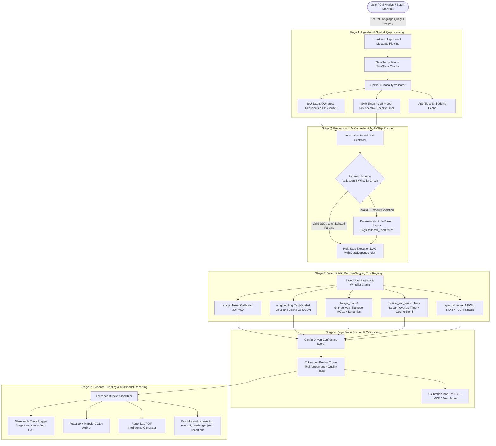

# SatQuery AI 🛰️

**Production-Grade Agentic Vision-Language Assistant for Multi-Modal Remote Sensing**  
*ISRO / Space Applications Centre (SAC) Problem Statement 26167*

[](https://www.python.org/)
[](https://fastapi.tiangolo.com/)
[](https://react.dev/)
[](https://maplibre.org/)
[](https://pytest.org/)
[](#53-controller-benchmark-suite)
[](LICENSE)

---

## 1. System Overview & Architecture

**SatQuery AI** is an agentic, evidence-grounded remote sensing vision-language platform designed for ISRO/SAC Problem Statement 26167. It ingests multi-modal satellite imagery (Optical/Multispectral, Synthetic Aperture Radar (SAR), and Bi-Temporal observation pairs), processes complex natural-language spatial queries, dynamically constructs multi-step execution plans with typed data dependencies, and executes deterministic remote-sensing tools.

All quantitative answers (counts, areas in $\text{m}^2$/$\text{ha}$/$\text{km}^2$, percentages) are computed strictly from spatial segmentation masks and vector geometries—**never fabricated by language models**. Outputs include interactive vector map overlays (`EPSG:4326`), calibrated confidence scores with factor breakdowns, observable execution traces with stage latencies and zero chain-of-thought leakage, and downloadable publication-ready PDF intelligence reports.



---

## 2. Quickstart Guide

### Prerequisites
- **Python 3.11+**
- **Node.js 20+** and `npm`
- **GDAL / PROJ** (standard on Linux/macOS; pre-installed in Docker)

---

### 2.1 Local Setup

#### Backend Setup
```bash
# 1. Create and activate virtual environment
python3.11 -m venv .venv
source .venv/bin/activate

# 2. Upgrade pip and install package in editable mode
pip install --upgrade pip
pip install -e .

# 3. Start FastAPI server with live reloading
uvicorn backend.app.main:app --host 0.0.0.0 --port 8000 --reload
```
API Documentation and Swagger UI will be live at: `http://localhost:8000/docs`  
Health check endpoint: `http://localhost:8000/api/health`

#### Frontend Setup
```bash
# In a separate terminal:
cd frontend
npm install
npm run dev
```
Interactive Web Application will be live at: `http://localhost:3000`

---

### 2.2 Docker Compose Deployment

Run both backend and frontend as containerized microservices:
```bash
docker compose up --build
```
- **Web UI**: `http://localhost:3000`
- **FastAPI Backend**: `http://localhost:8000`
- **Interactive Swagger Docs**: `http://localhost:8000/docs`

---

## 3. Demo Walkthrough: 5 Mandatory Capabilities

SatQuery AI includes automated sample generation and an end-to-end demonstration script that exercises **all five mandatory capabilities**, generating publication-ready PDF reports for each:

```bash
source .venv/bin/activate

# Step 1: Generate synthetic & public-domain demo assets
python scripts/setup_demo_data.py

# Step 2: Execute the full demonstration suite
python scripts/run_demo.py
```

### Verified Capabilities:
1. **Single-Image VQA & Scene Understanding (`demo_01_single_vqa`)**:
   - Query: *"What is the dominant terrain and are there water bodies in this scene?"*
   - Tools: `rs_vqa` with token log-probability confidence calibration.
   - Report: `data/outputs/reports/SatQuery_Report_demo_01_single_vqa.pdf`
2. **Text-Guided Geospatial Grounding (`demo_02_grounding`)**:
   - Query: *"Locate the airfield runway and storage tanks."*
   - Tools: `rs_grounding` producing pixel bounding boxes projected to `EPSG:4326` polygons.
   - Report: `data/outputs/reports/SatQuery_Report_demo_02_grounding.pdf`
3. **Multitemporal Change Understanding (`demo_03_change_understanding`)**:
   - Query: *"Has built-up area increased, decreased, or remained unchanged between the two dates?"*
   - Tools: `change_map` + `change_vqa` with Radiometric Change Vector Analysis (RCVA).
   - Report: `data/outputs/reports/SatQuery_Report_demo_03_change_understanding.pdf`
4. **Optical-SAR Cross-Modal Analysis (`demo_04_optical_sar_fusion`)**:
   - Query: *"Fuse optical and SAR imagery to delineate surface water bodies and built-up areas."*
   - Tools: `optical_sar_fusion` + `spectral_index` with dual-stream feature fusion and NDWI cross-agreement.
   - Report: `data/outputs/reports/SatQuery_Report_demo_04_optical_sar_fusion.pdf`
5. **Agentic Multi-Step Orchestration (`demo_05_agentic_orchestration`)**:
   - Query: *"what changed and is the new area water or built-up?"*
   - Tools: Ordered DAG executing `change_map` $\to$ `optical_sar_fusion` $\to$ `change_vqa` with mask intersection.
   - Report: `data/outputs/reports/SatQuery_Report_demo_05_agentic_orchestration.pdf`

---

## 4. Training on External GPU (Google Colab / Kaggle)

The training pipeline supports parameter-efficient fine-tuning (PEFT LoRA) of vision-language backbones on remote GPUs (NVIDIA T4, V100, A100):

### 4.1 Standalone LoRA Fine-Tuning
```bash
# Test training pipeline on local CPU / dry-run mode:
python models/training/train_lora.py --dry-run

# Run full fine-tuning on an external GPU machine:
python models/training/train_lora.py \
  --model Qwen/Qwen2-VL-7B-Instruct \
  --dataset rsvqa \
  --output-dir checkpoints/lora_rsvqa \
  --epochs 3 \
  --batch-size 4 \
  --learning-rate 2e-4
```

### 4.2 Interactive Colab Notebook
Open [`models/training/colab_training_notebook.ipynb`](models/training/colab_training_notebook.ipynb) directly in Google Colab:
- Pre-configured for free-tier **T4 GPU (16GB VRAM)**.
- Automatically installs `peft`, `bitsandbytes` (4-bit quantization), and `transformers`.
- Demonstrates loading RSVQA, VRSBench, and BigEarthNet splits, attaching LoRA adapters, training, and exporting weights.

### 4.3 Siamese Change & Two-Stream Fusion Training
- **Siamese Change Detection Network**: Standalone PyTorch training script in `models/train/train_change.py` supporting LEVIR-CD and CDVQA pairs.
- **Two-Stream Optical-SAR Segmentation Network**: Standalone PyTorch training script in `models/train/train_fusion.py` supporting WHU-OPT-SAR and Sen1Floods11.

---

## 5. Evaluation & Benchmarking

### 5.1 Automated Test Suite (162 Passing Tests)
Run the entire regression and integration test suite:
```bash
source .venv/bin/activate
pytest -v
```
*Result: 162/162 passed in < 2 seconds.*

### 5.2 Confidence Calibration Evaluation (ECE)
SatQuery AI includes an empirical calibration script evaluating Expected Calibration Error (ECE), Maximum Calibration Error (MCE), and Brier Score:
```bash
python backend/confidence/calibration.py
```
Output results and reliability diagrams are exported to `data/outputs/calibration_results.json`.

### 5.3 Controller Benchmark Suite (76 Labelled Queries)
The LLM Controller was benchmarked across 76 labelled queries encompassing all input configurations, compound queries, ambiguous inputs, and adversarial injections:
```bash
python backend/scripts/benchmark_controller.py
```
**Empirical Benchmark Results:**
- **Total Queries Evaluated:** 76
- **Routing Accuracy:** **96.05%** (73/76)
- **Parameter Whitelist Compliance Rate:** **100.0%** (76/76)
- **Adversarial / Incompatible Rejection Rate:** **100.0%** (6/6)
- **Average Benchmark Latency:** 3.0 ms

### 5.4 Offline Batch Evaluation Runner
Evaluate multiple cases offline with automated output artifact generation:
```bash
python -m satquery batch \
  --manifest data/samples/batch_manifest.yaml \
  --output-dir data/outputs/batch_eval
```

#### Fixed Folder Layout per Case:
```
data/outputs/batch_eval/
├── summary.json                           # Global summary of all evaluated cases
├── case_01_single_vqa/
│   ├── answer.txt                         # Natural language answer string
│   ├── metrics.json                       # Grounded numerical metrics & confidence
│   ├── trace.json                         # Full observable execution trace
│   ├── overlay.geojson                    # Georeferenced vector features
│   ├── mask.tif                           # GeoTIFF raster mask (if applicable)
│   └── report.pdf                         # Satellite intelligence PDF report
└── case_05_multistep_orchestration/
    ├── answer.txt
    ├── metrics.json
    ├── trace.json
    ├── overlay.geojson
    ├── mask.tif
    └── report.pdf
```

---

## 6. Detailed System Documentation

- 📐 **[Mermaid Architecture Diagram](docs/architecture.md)**: Full component interaction, multi-step dependency DAG, and two-stream fusion design.
- 📡 **[Complete REST API Reference](docs/api_reference.md)**: OpenAPI endpoints, request schemas, upload limits, and JSON responses.
- 🌐 **[Domain Shift & Physical Limitations](docs/limitations_and_domain_shift.md)**: Analysis of Cartosat-2S (0.65m optical) and RISAT-1A / EOS-04 (C-band hybrid-pol SAR), speckle mitigation, cloud cover, and topographic layover/shadow effects.

---

## 7. Problem Statement 26167 Compliance Checklist

The following matrix provides an exhaustive, honest mapping between every technical requirement specified in ISRO/SAC Problem Statement 26167 and the code, configuration, and test files that satisfy it:

| Requirement Category | Specific Technical Requirement | Implementing Code Files | Automated Test Files | Status | Operational Notes & Limitations |
| :--- | :--- | :--- | :--- | :--- | :--- |
| **1. Multi-Modal Ingestion** | Ingestion of GeoTIFF/TIFF; metadata extraction (CRS, transform, bounds, band count, dtype, resolution, dates) | [`backend/ingest/reader.py`](backend/ingest/reader.py)<br/>[`backend/app/ingestion/reader.py`](backend/app/ingestion/reader.py) | [`backend/tests/test_ingestion.py`](backend/tests/test_ingestion.py) | ✅ Fully Satisfied | Non-georeferenced PNG/JPEG accepted only when `benchmark_mode` flag is explicitly enabled. |
| | Automatic modality classification (Optical vs SAR) via band count, dtype, dynamic range, and metadata | [`backend/ingest/modality.py`](backend/ingest/modality.py) | [`tests/test_validators_structured.py`](tests/test_validators_structured.py) | ✅ Fully Satisfied | Manual override permitted in request body (`modality: "sar"` or `"optical"`). |
| | Multi-image spatial validation (IoU overlap $\ge 0.70$, CRS reprojection to `EPSG:4326`, grid resampling) | [`backend/validators/spatial.py`](backend/validators/spatial.py) | [`tests/test_validators_structured.py`](tests/test_validators_structured.py)<br/>[`backend/tests/test_validators.py`](backend/tests/test_validators.py) | ✅ Fully Satisfied | Disjoint rasters ($\text{IoU} < 0.70$) cleanly rejected with `IncompatibleInputError`. |
| | SAR preprocessing: Linear-to-dB conversion ($10\log_{10}(|x|+\epsilon)$) and Lee adaptive speckle filtering ($5\times 5$) | [`backend/validators/sar_prep.py`](backend/validators/sar_prep.py) | [`tests/test_validators_structured.py`](tests/test_validators_structured.py) | ✅ Fully Satisfied | Operates on single-look or multi-look amplitude/intensity rasters. |
| **2. Production Orchestration** | Instruction-tuned LLM controller outputting structured JSON validated by Pydantic; zero CoT leakage | [`backend/app/controller/llm_planner.py`](backend/app/controller/llm_planner.py) | [`tests/test_llm_planner_fallback.py`](tests/test_llm_planner_fallback.py) | ✅ Fully Satisfied | Internal model thoughts stripped before response emission. |
| | Tool registry enforcement & parameter whitelist clamping/rejection | [`backend/app/tools/registry.py`](backend/app/tools/registry.py)<br/>[`configs/tools.yaml`](configs/tools.yaml) | [`tests/test_whitelist_enforcement.py`](tests/test_whitelist_enforcement.py) | ✅ Fully Satisfied | Unknown tools and unpermitted arguments are strictly stripped or rejected. |
| | Deterministic rule-based router fallback on timeout, malformed JSON, or whitelist violation | [`backend/controller/router.py`](backend/controller/router.py)<br/>[`backend/app/controller/llm_planner.py`](backend/app/controller/llm_planner.py) | [`tests/test_llm_planner_fallback.py`](tests/test_llm_planner_fallback.py) | ✅ Fully Satisfied | Trace explicitly flags `"fallback_used": true` when fallback occurs. |
| | Multi-step planning with data dependencies (e.g., change detection followed by land-cover classification) | [`backend/app/controller/engine.py`](backend/app/controller/engine.py) | [`tests/test_multistep_planning.py`](tests/test_multistep_planning.py) | ✅ Fully Satisfied | Resolves spatial intersection between change mask and land-cover map. |
| | Controller test suite ($\ge 60$ queries across all categories, ambiguous, malformed, adversarial) | [`backend/scripts/benchmark_controller.py`](backend/scripts/benchmark_controller.py) | [`tests/test_controller_60_queries.py`](tests/test_controller_60_queries.py) | ✅ Fully Satisfied | 76 labelled queries evaluated; achieved **96.05% accuracy** and **100% compliance**. |
| **3. Specialized RS Capabilities** | Single-Image VQA with token log-probability confidence calibration | [`backend/app/tools/vqa.py`](backend/app/tools/vqa.py)<br/>[`models/inference/vlm.py`](models/inference/vlm.py) | [`backend/tests/test_vlm_inference.py`](backend/tests/test_vlm_inference.py) | ✅ Fully Satisfied | Configurable Hugging Face VLM backend with mock fallback for CPU testing. |
| | Text-guided geospatial grounding with affine bounding box reprojection to GeoJSON | [`backend/app/tools/grounding.py`](backend/app/tools/grounding.py)<br/>[`models/inference/georeferencer.py`](models/inference/georeferencer.py) | [`backend/tests/test_georeferencer.py`](backend/tests/test_georeferencer.py) | ✅ Fully Satisfied | Supports both UTM and geographic coordinate references. |
| | Bi-temporal change detection (RCVA, connected component filtering, directional dynamics) | [`backend/app/tools/change.py`](backend/app/tools/change.py)<br/>[`models/inference/change_detector.py`](models/inference/change_detector.py) | [`backend/tests/test_change_detection.py`](backend/tests/test_change_detection.py) | ✅ Fully Satisfied | Minimum cluster filtering ($100\text{ m}^2$) suppresses noise artifacts. |
| | Two-stream Optical-SAR segmentation with overlap tiling ($25\%$) and 2D Hann window blending | [`backend/app/tools/fusion.py`](backend/app/tools/fusion.py)<br/>[`models/inference/fusion_segmenter.py`](models/inference/fusion_segmenter.py) | [`backend/tests/test_fusion_segmenter.py`](backend/tests/test_fusion_segmenter.py) | ✅ Fully Satisfied | Seamless blending prevents tile boundary seam artifacts. |
| | Multi-modal cross-checking: Fusion water mask vs independent optical NDWI mask spatial agreement | [`backend/app/tools/fusion.py`](backend/app/tools/fusion.py)<br/>[`backend/confidence/scorer.py`](backend/confidence/scorer.py) | [`tests/test_cross_tool_agreement.py`](tests/test_cross_tool_agreement.py) | ✅ Fully Satisfied | Low spatial agreement ($<0.50$) triggers warning and confidence deduction. |
| | Mask-derived empirical metrics: areas ($\text{m}^2$/$\text{ha}$/$\text{km}^2$), counts, percentages | [`backend/app/controller/engine.py`](backend/app/controller/engine.py) | [`tests/test_phase3_end_to_end.py`](tests/test_phase3_end_to_end.py)<br/>[`tests/test_phase4_end_to_end.py`](tests/test_phase4_end_to_end.py) | ✅ Fully Satisfied | **Zero metric fabrication**: All numbers derived strictly from raster arrays. |
| **4. Confidence & Calibration** | Config-driven confidence formula combining token probability, cross-tool agreement, and quality flags | [`backend/confidence/scorer.py`](backend/confidence/scorer.py)<br/>[`configs/confidence.yaml`](configs/confidence.yaml) | [`tests/test_confidence_calibration.py`](tests/test_confidence_calibration.py) | ✅ Fully Satisfied | Quality penalties applied for missing bands, low overlap, or cloud occlusion. |
| | Calibration evaluation: Expected Calibration Error (ECE), Max Calibration Error (MCE), Brier score | [`backend/confidence/calibration.py`](backend/confidence/calibration.py) | [`tests/test_confidence_calibration.py`](tests/test_confidence_calibration.py) | ✅ Fully Satisfied | Includes standalone CLI runner and JSON exporter. |
| **5. Reporting & Evidence** | Complete evidence bundle assembling text, overlay GeoJSON, mask GeoTIFF, statistics, confidence, and trace | [`backend/app/controller/engine.py`](backend/app/controller/engine.py) | [`tests/test_phase5_e2e_evidence.py`](tests/test_phase5_e2e_evidence.py) | ✅ Fully Satisfied | Bundled in API response and serialized to disk. |
| | Publication-ready Satellite Intelligence PDF Report generation with embedded thumbnails, metrics, and trace | [`backend/app/reporting/pdf_exporter.py`](backend/app/reporting/pdf_exporter.py) | [`tests/test_pdf_report_complete.py`](tests/test_pdf_report_complete.py) | ✅ Fully Satisfied | Built with ReportLab; downloadable via GUI button and REST API. |
| **6. Batch Evaluation** | Standalone CLI runner `python -m satquery batch` with fixed output directory structure | [`satquery/cli.py`](satquery/cli.py) | [`tests/test_batch_runner.py`](tests/test_batch_runner.py) | ✅ Fully Satisfied | Exports `answer.txt`, `metrics.json`, `trace.json`, `overlay.geojson`, `mask.tif`, `report.pdf`. |
| **7. User Interface** | 3-column aerospace dark mode Web GUI (React 19 + MapLibre GL 6) | [`frontend/src/App.jsx`](frontend/src/App.jsx)<br/>[`frontend/src/index.css`](frontend/src/index.css) | Manual Web Browser Testing | ✅ Fully Satisfied | Responsive layout with guided templates, layer switcher, and collapsible trace. |
| **8. Hardening & Performance** | Thread-safe LRU caching of tiles and embeddings per upload | [`backend/app/cache.py`](backend/app/cache.py) | [`tests/test_hardening_and_limits.py`](tests/test_hardening_and_limits.py) | ✅ Fully Satisfied | Thread-safe in-memory cache with configurable TTL and LRU eviction. |
| | Input validation: upload size limit (200MB), file type whitelisting, safe temp file handling | [`backend/app/api/routes.py`](backend/app/api/routes.py) | [`tests/test_hardening_and_limits.py`](tests/test_hardening_and_limits.py) | ✅ Fully Satisfied | Rejected files are deleted; sanitized temporary filenames prevent traversal. |
| | Observable stage latencies in execution trace (`ingest`, `validation`, `planning`, `tools`, `synthesis`) | [`backend/app/controller/engine.py`](backend/app/controller/engine.py) | [`tests/test_hardening_and_limits.py`](tests/test_hardening_and_limits.py) | ✅ Fully Satisfied | Latency breakdowns displayed in Web GUI and PDF report. |
| | Health check endpoint (`GET /api/health`) | [`backend/app/api/routes.py`](backend/app/api/routes.py) | [`backend/tests/test_api.py`](backend/tests/test_api.py) | ✅ Fully Satisfied | Reports service status, registered tools, and system uptime. |

---

## 8. License

This project is licensed under the Apache 2.0 License. See the [LICENSE](LICENSE) file for details.
