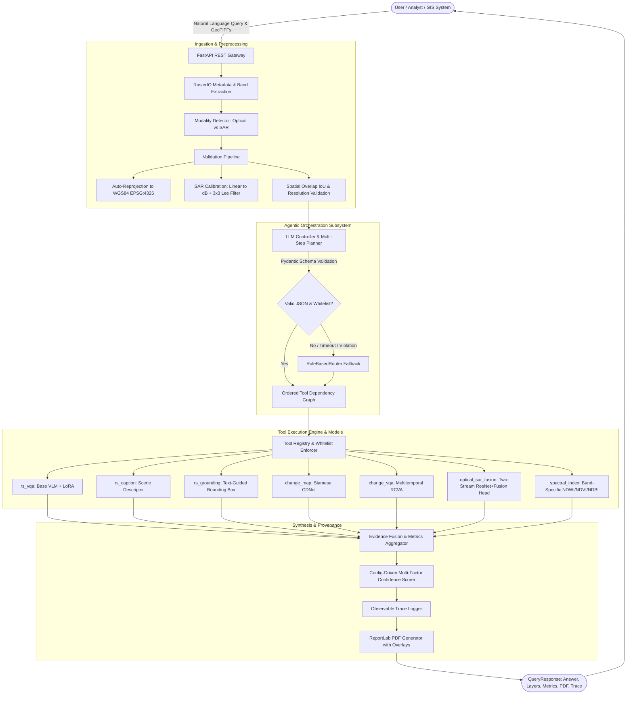
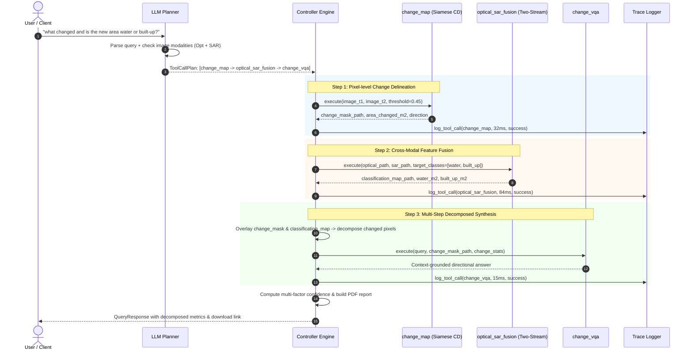

# SatQuery AI Architecture & System Design
**ISRO/SAC Problem Statement 26167: Agentic Vision-Language Assistant for Earth Observation**

SatQuery AI is designed as a modular, observable, and strictly grounded remote sensing intelligence system. It combines an instruction-tuned LLM planner, a two-stream deep learning fusion network, a Siamese change-detection network, a specialized satellite VLM, and an automated audit trace.

---

## 1. High-Level System Architecture

---

## 2. Multi-Step Agentic Planning Sequence

The following sequence illustrates how compound queries such as *"what changed and is the new area water or built-up?"* are planned and executed across data dependencies:

---

## 3. Two-Stream Optical + SAR Cross-Modal Architecture

```mermaid
flowchart LR
    subgraph Optical Stream
        Opt[Optical Multispectral 4-Band] --> OptEnc[ResNet Backbone Optical Encoder]
        OptEnc --> OptFeat[Optical Feature Map 256x64x64]
    end

    subgraph SAR Stream
        SAR[SAR Backscatter Amplitude in dB] --> SAREnc[ResNet Backbone SAR Encoder]
        SAREnc --> SARFeat[SAR Feature Map 256x64x64]
    end

    subgraph Cross-Attention & Fusion Head
        OptFeat --> Concat[Feature Concatenation 512-ch]
        SARFeat --> Concat
        Concat --> SqueezeConv[1x1 Conv + BatchNorm + ReLU]
        SqueezeConv --> FusedFeat[Fused Representation 256-ch]
    end

    subgraph Segmentation Decoder
        FusedFeat --> Up1[Transposed Conv 2x]
        Up1 --> Up2[Transposed Conv 2x]
        Up2 --> ClassHead[1x1 Conv Logits: Background, Water, Built-up]
        ClassHead --> Softmax[Softmax Segmentation Mask]
    end

    Softmax --> WaterPoly[GeoJSON Water Polygons]
    Softmax --> BuiltPoly[GeoJSON Built-up Polygons]
    Softmax --> MaskGeoTIFF[Class Mask GeoTIFF]
```

---

## 4. Multi-Factor Confidence Scoring Model

The confidence score $C \in [0, 1]$ is computed deterministically via `configs/confidence.yaml`:

$$C = w_{\text{token}} \cdot S_{\text{token}} + w_{\text{agreement}} \cdot S_{\text{agreement}} + w_{\text{quality}} \cdot S_{\text{quality}}$$

Where:
- **$S_{\text{token}}$**: Model prediction probability or calibrated baseline.
- **$S_{\text{agreement}}$**: Spatial agreement score between complementary tools (e.g. Optical-SAR Fusion water mask vs NDWI spectral index mask IoU).
- **$S_{\text{quality}}$**: Input sensor quality score ($1.0 - \sum \text{penalties}$ for resampling, missing spectral bands, or low spatial footprint overlap).
